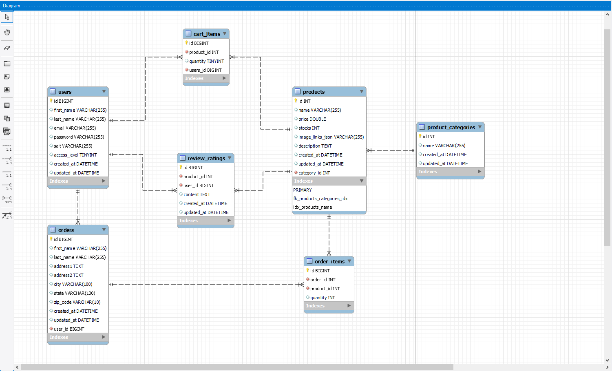

# Description

### Purely Organic Shop: E-Commerce

An e-commerce project that demonstrates what I have learned in the 4-week long PHP Track in Village88 Coding Bootcamp. 

This project serves as my stepping stone in understanding how complex applications works and how it's built. 

**Technologies used:** HTML, CSS, JavaScript, JQuery, Ajax, PHP, CodeIgniter, Stripe API, PHPMailer API

## App Features
The clickable prototype of the __core features__ were built initially by 
[__Jhaver Jan Gurtiza__]( linkedin.com/in/jgurtiza), UI/UX Engineer and Frontend Developer of Village88. Initial pages as seen in the prototype: [__Prototype in Figma__](https://www.figma.com/file/lnxxTTQStJyVsuWAa8FiDJ/Organic-Shop?type=design&node-id=0-1&mode=design)
### Core Features:
- Admin manages orders
- CRUD functionality of Products
- Cart page
- Ordering system
### Extras:
- Profile Page
- CRUD functionality of Product Categories
- Order History
- Email Notification
## Demo
### Coming Soon...

## Database ERD

## Cloning Prerequisites
Make sure you have theses installed if you want to clone the application.
- [PHP](https://www.php.net/downloads) *version used 7.4.33*
- [WAMP](https://www.wampserver.com/en/) or [MAMP](https://www.mamp.info/en/windows/) or [XAMPP](https://www.apachefriends.org/)
- [MySQL](https://www.mysql.com/products/workbench/) *version used 8.0.33*

## What I leaned in this project
I will update once I'm done 😉